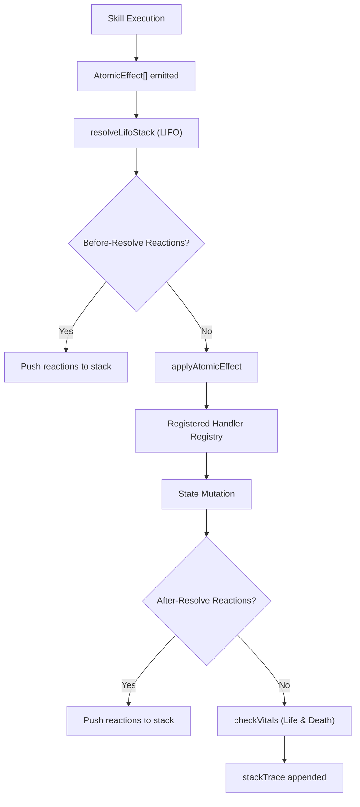
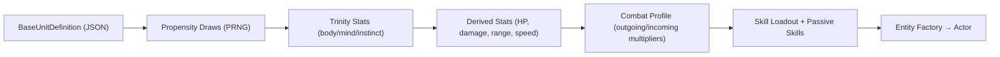
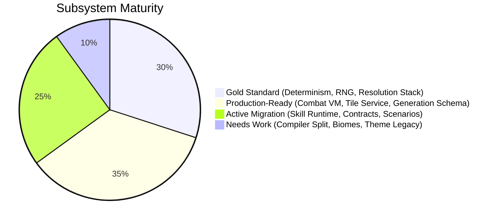

# Hop Phase 2 Architectural Audit — Full Gap Analysis

> **Auditor:** Antigravity  
> **Date:** April 19, 2026  
> **Scope:** Engine determinism, Combat VM, Map Scaffolding, Data-Driven Pipeline, Unit Composition, Testing Infrastructure, Performance

---

## Executive Summary

The Hop engine is in an **exceptionally mature headless-first state**. The architecture has successfully transitioned past the critical "hardcoded MVP" phase into a compositional, data-driven posture. The codebase demonstrates industry-leading practices in several domains (deterministic PRNG, LIFO resolution stack, generation compiler with verification). The remaining work is primarily **migration completion and hardening**, not architectural redesign.

> [!IMPORTANT]
> **Overall Assessment: 8.5 / 10 — Production-Grade Architecture with Active Migration**
> 
> The engine is significantly ahead of most indie tactical games in structural maturity. The gaps identified below are evolutionary, not foundational.

---

## 1. Headless Engine & Determinism

### Current State: ✅ **Gold Standard**

| Criterion | Status | Evidence |
|-----------|--------|----------|
| State ↔ UI decoupling | ✅ Complete | `gameReducer` in [logic.ts](file:///c:/Users/philippe.cave/Documents/Antigravity/Hop/packages/engine/src/logic.ts) is a pure function `(GameState, Action) → GameState` |
| No `Math.random()` in engine | ✅ Enforced | Mulberry32 PRNG in [rng.ts](file:///c:/Users/philippe.cave/Documents/Antigravity/Hop/packages/engine/src/systems/rng.ts) with `rngSeed` + `rngCounter` state tracking |
| Immutable state transitions | ✅ Verified | Spread operators throughout; `{...state}` pattern in all reducers |
| Replay validation | ✅ Active | `validateReplay.ts` script + [replay_validation.test.ts](file:///c:/Users/philippe.cave/Documents/Antigravity/Hop/packages/engine/src/__tests__/replay_validation.test.ts) |
| Floating-point safety | ✅ Mitigated | Integer-only combat via `Math.floor()` + [fixed-point.ts](file:///c:/Users/philippe.cave/Documents/Antigravity/Hop/packages/engine/src/data/fixed-point.ts) with `SCALED_IDENTITY` |

### Gap Analysis

| Gap | Severity | Detail |
|-----|----------|--------|
| Generation compiler uses `Math.imul` for hashing | 🟢 Low | `hashString()` in [compiler.ts:178](file:///c:/Users/philippe.cave/Documents/Antigravity/Hop/packages/engine/src/generation/compiler.ts#L178) and [telemetry.ts:14](file:///c:/Users/philippe.cave/Documents/Antigravity/Hop/packages/engine/src/generation/telemetry.ts#L14) — duplicated FNV-1a. Should be extracted to a shared utility. |
| `Set` serialization caveat | 🟡 Medium | Tile traits use `Set<TileTrait>` ([tile-types.ts:79](file:///c:/Users/philippe.cave/Documents/Antigravity/Hop/packages/engine/src/systems/tiles/tile-types.ts#L79)). The TODO at the top of the file acknowledges this. JSON round-trips require explicit `Array.from()` / `new Set()` hydration. |
| `hashString` duplication | 🟢 Low | Same FNV-1a implementation exists in both `compiler.ts` and `telemetry.ts`. DRY violation. |

### Recommendation

The determinism story is **complete and battle-tested**. The only action items are housekeeping (DRY the hash utility, document the Set serialization contract in a central place).

---

## 2. Combat VM & Resolution Stack

### Current State: ✅ **Robust — Stack-Based Resolution with Reaction Windows**

The combat system is built on a **deterministic LIFO resolution stack** ([resolution-stack.ts](file:///c:/Users/philippe.cave/Documents/Antigravity/Hop/packages/engine/src/systems/resolution-stack.ts)) that supports:

- **Before-resolve** and **after-resolve** reaction injection
- **Top-of-stack** and **bottom-of-stack** enqueue positions
- **Full stack traces** for debugging (`StackResolutionTick[]`)
- **Monotonic timeline phase ordering** with warnings for violations

The [effect-engine.ts](file:///c:/Users/philippe.cave/Documents/Antigravity/Hop/packages/engine/src/systems/effect-engine.ts) acts as the middleware layer:

```
AtomicEffect[] → resolveLifoStack → applyAtomicEffect → registered handlers → state mutation
```



### The `GrandCalculator` — Combat Math

The [combat-calculator.ts](file:///c:/Users/philippe.cave/Documents/Antigravity/Hop/packages/engine/src/systems/combat/combat-calculator.ts) is a **fully parameterized, stateless combat resolver**:

- Trinity-stat projection (body → physical, mind → magical, instinct → crit/hit-quality)
- Configurable coefficients via `projectionCoefficients` and `hitQualityCoefficients`
- Damage taxonomy: `CombatDamageClass × CombatDamageSubClass × CombatDamageElement`
- Hit quality tiers with per-weapon-type tracking signatures (`melee`, `projectile`, `magic`)
- Full `CombatScoreEvent` telemetry output for balance analysis

### Gap Analysis

| Gap | Severity | Detail |
|-----|----------|--------|
| Theme interceptors are partially legacy | 🟡 Medium | [theme.ts](file:///c:/Users/philippe.cave/Documents/Antigravity/Hop/packages/engine/src/systems/theme.ts) `slipperyInterceptor` and `voidInterceptor` operate outside the registered effect handler pattern. The comment in `effect-engine.ts:222` confirms "Legacy themeInterceptors decommissioned" but the file still exists and is importable. |
| `occupantId` dual source of truth | 🟡 Medium | [tile-types.ts:81-83](file:///c:/Users/philippe.cave/Documents/Antigravity/Hop/packages/engine/src/systems/tiles/tile-types.ts#L81) contains an `occupantId` on `Tile` with a `@warning` about sync with `occupancyMask` and `Actor.position`. This triple-tracking pattern is a maintainability risk. |
| `round3` precision in combat math | 🟢 Low | `Math.round(value * 1000) / 1000` in [combat-calculator.ts:186](file:///c:/Users/philippe.cave/Documents/Antigravity/Hop/packages/engine/src/systems/combat/combat-calculator.ts#L186) — this is fine for display but should not influence downstream calculations. Currently used only for `scoreEvent` telemetry. |
| No explicit max-stack-depth guard | 🟡 Medium | `resolveLifoStack` has no configurable depth limit. Theoretically, infinite reaction chains could stack-overflow. Production skills are well-bounded, but for a data-driven future where users author skills, a safety limiter (e.g., 200 ticks) would be prudent. |

### Recommendation

> [!TIP]
> 1. **Delete `theme.ts`** or move its logic into registered effect handlers. The interceptor pattern is dead code sitting next to a live system.
> 2. **Add a `maxDepth` guard** to `resolveLifoStack` (default 200, configurable).
> 3. **Deprecate `occupantId` on Tile** — the `occupancyMask` BigInt is the canonical source.

---

## 3. Map Scaffolding & Generation Compiler

### Current State: ✅ **Industry-Leading — Multi-Pass Compiler with Verification**

The generation system is the most architecturally advanced subsystem in the engine. The [generation/schema.ts](file:///c:/Users/philippe.cave/Documents/Antigravity/Hop/packages/engine/src/generation/schema.ts) defines a **750-line type schema** covering a full compiler pipeline:

```
18 Compiler Passes:
normalizeSpec → accumulateFloorTelemetry → quantizeFloorOutcome → updateRunDirectorState
→ resolveFloorIntent → resolveNarrativeSceneRequest → buildTopologicalBlueprint
→ reserveSpatialBudget → emitPathProgram → embedSpatialPlan → resolveModulePlan
→ registerSpatialClaims → realizeArenaArtifact → realizeSceneEvidence
→ closeUnresolvedGaskets → classifyPathLandmarks → buildTacticalPathNetwork
→ buildVisualPathNetwork → applyEnvironmentalPressure → verifyArenaArtifact
→ finalizeGenerationState
```

Key architectural strengths:
- **Director-driven intent resolution** — floor difficulty adapts based on `DirectorState` bands (tension, fatigue, resource stress, redline)
- **Narrative scene signatures** — motifs, moods, and evidence are tracked to prevent repetition
- **Module system** with capability signatures and collision masks for constraint-based placement
- **Dual-route topology** with primary/alternate paths, junctions, and environmental pressure clusters
- **Verification reports** with suggested relaxations for constraint failures
- **Parity-aware spatial budgeting** for closed-path requirements

### The `UnifiedTileService`

[unified-tile-service.ts](file:///c:/Users/philippe.cave/Documents/Antigravity/Hop/packages/engine/src/systems/tiles/unified-tile-service.ts) is the **single source of truth** for tile queries:

- Handles `Map`, `Array`, and plain-object representations of `state.tiles` (legacy compat)
- Derives traits from `baseId` + `instance traits` + `dynamic effects`
- Perimeter checks via `isHexInRectangularGrid`

### Gap Analysis

| Gap | Severity | Detail |
|-----|----------|--------|
| `getTileAt` polymorphism overhead | 🟡 Medium | [unified-tile-service.ts:15-26](file:///c:/Users/philippe.cave/Documents/Antigravity/Hop/packages/engine/src/systems/tiles/unified-tile-service.ts#L15) checks `Map`, `Array`, and plain-object forms of `state.tiles` every call. At runtime, tiles is always a `Map`. The array/object branches are legacy compat that should be removed behind a migration flag. |
| WFC not yet integrated | 🟡 Medium | The generation compiler uses a **constraint-based module placement** system that is functionally a hand-authored WFC precursor. The `ModuleRegistryEntry` with `ModuleCollisionMask`, `ModuleCapabilitySignature`, and `ModuleEquivalenceClass` already provides the vocabulary. True WFC would replace the `embedSpatialPlan` loop with arc-consistency propagation. |
| Biome system is minimal | 🟡 Medium | [biomes.ts](file:///c:/Users/philippe.cave/Documents/Antigravity/Hop/packages/engine/src/systems/biomes.ts) is only 10 lines: two functions mapping `FloorTheme` → hazard tile/flavor. The `@conversation a7a9bad2` already designed a full data-driven biome architecture. This needs to be landed. |
| Generation compiler is a 3,928-line monolith | 🔴 High | [compiler.ts](file:///c:/Users/philippe.cave/Documents/Antigravity/Hop/packages/engine/src/generation/compiler.ts) is the largest file in the engine. While internally well-structured with pure functions, the file itself should be split into pass-specific modules (e.g., `passes/intent.ts`, `passes/topology.ts`, `passes/spatial.ts`). |

### Recommendation

> [!WARNING]
> The generation compiler is the highest-priority refactoring target. At 3,928 lines, it's approaching the threshold where cognitive load impedes safe modification. Each compiler pass should be extractable into its own module file, with the main `compiler.ts` reduced to an orchestrator.

---

## 4. Data-Driven Content Pipeline

### Current State: ✅ **Active Migration — Strong Foundation, Incomplete Coverage**

The data-driven infrastructure is **mature and validated**:

#### JSON Schemas (3 active)
| Schema | Path | Status |
|--------|------|--------|
| Base Unit | [base-unit.schema.json](file:///c:/Users/philippe.cave/Documents/Antigravity/Hop/packages/engine/src/data/schemas/base-unit.schema.json) | ✅ Active |
| Composite Skill | [composite-skill.schema.json](file:///c:/Users/philippe.cave/Documents/Antigravity/Hop/packages/engine/src/data/schemas/composite-skill.schema.json) | ✅ Active |
| Skill Authoring | [skill-authoring.schema.json](file:///c:/Users/philippe.cave/Documents/Antigravity/Hop/packages/engine/src/data/schemas/skill-authoring.schema.json) | ✅ Active |

#### Contract Parser ([contract-parser.ts](file:///c:/Users/philippe.cave/Documents/Antigravity/Hop/packages/engine/src/data/contract-parser.ts))
- `validateBaseUnitDefinition` — 45-field deep validation
- `validateCompositeSkillDefinition` — full skill contract validation including upgrades, effects, and targeting
- `parseTacticalDataPack` — batch validation for content packs
- `compileBaseUnitBlueprint` / `compileCompositeSkillTemplate` — compilation to runtime-ready templates

#### Contracts ([contracts.ts](file:///c:/Users/philippe.cave/Documents/Antigravity/Hop/packages/engine/src/data/contracts.ts))
The `CompositeSkillDefinition` is a comprehensive data contract covering:
- Targeting (mode, range, LoS, AoE, deterministic sort)
- Stack policy (LIFO, reaction windows)
- Base action (costs, effects)
- Reactive passives
- **Upgrades with compositional modifiers** (`add_effect`, `remove_effect_by_tag`, `modify_number`, `add_keyword`, `add_reaction`)

#### Propensity Model
The `BaseUnitDefinition` uses a **statistical propensity system** for unit generation:
- `fixed`, `uniform_int`, `triangular_int`, `weighted_table` distributions
- PRNG-driven instantiation via `PropensityRngCursor`
- Derived stats with formula evaluation (`trinity_hp_v1`, `linear`)

### Gap Analysis

| Gap | Severity | Detail |
|-----|----------|--------|
| Skill Runtime still has a 202KB generated file | 🔴 High | [skill-runtime.generated.ts](file:///c:/Users/philippe.cave/Documents/Antigravity/Hop/packages/engine/src/generated/skill-runtime.generated.ts) at **202,209 bytes** suggests significant imperative skill logic is still being code-generated rather than driven by JSON definitions at runtime. |
| Executor is 90KB | 🔴 High | [executor.ts](file:///c:/Users/philippe.cave/Documents/Antigravity/Hop/packages/engine/src/systems/skill-runtime/executor.ts) at **90,223 bytes** is the runtime that interprets skill definitions. Its size suggests feature-specific branches that should be data-driven. |
| Scenario files are imperative TypeScript | 🟡 Medium | The 44 scenario files in `packages/engine/src/scenarios/` are .ts files with setup/run/verify functions. For a "Gold Standard" pipeline, these should migrate to JSON scenario specs + a generic runner. |
| Enemy content is hardcoded TypeScript | 🟡 Medium | [mvp-enemy-content.ts](file:///c:/Users/philippe.cave/Documents/Antigravity/Hop/packages/engine/src/data/packs/mvp-enemy-content.ts) defines 10 enemy subtypes as TypeScript objects. The `BaseUnitDefinition` schema is ready to receive these as JSON, but the migration hasn't happened. |
| `skill-authoring.ts` is 49KB | 🟡 Medium | The skill authoring validation layer at 49,172 bytes contains significant logic that might be better expressed as a schema + validator pattern. |
| Fixed-point migration is in-progress | 🟡 Medium | [fixed-point-migration.ts](file:///c:/Users/philippe.cave/Documents/Antigravity/Hop/packages/engine/src/data/fixed-point-migration.ts) at 8,332 bytes suggests the transition to deterministic integer arithmetic is ongoing. |
| Combat tuning ledger is large | 🟡 Medium | [combat-tuning-ledger.ts](file:///c:/Users/philippe.cave/Documents/Antigravity/Hop/packages/engine/src/data/combat-tuning-ledger.ts) at 23,883 bytes should migrate to a JSON tuning file that can be hot-swapped without rebuilds. |

### Recommendation

> [!CAUTION]
> The **202KB generated skill runtime** is the single largest bottleneck to the "Gold Standard" content pipeline. This file likely contains per-skill execution branches that should be replaced by the composite skill VM interpreting `CompositeSkillDefinition` JSON at runtime. This is the #1 migration priority.

---

## 5. Unit Composition Model

### Current State: ✅ **Well-Architected — Trinity + Propensity + Derived Stats**

The unit composition pipeline follows a clear flow:



Key features:
- **Trinity system** — body (physical), mind (magical), instinct (agility/crit) — drives all derived stats
- **Propensity distributions** — four methods with deterministic PRNG sampling
- **Derived combat stats** computed purely from trinity + skill loadout ([derived-combat-stats.ts](file:///c:/Users/philippe.cave/Documents/Antigravity/Hop/packages/engine/src/data/enemies/derived-combat-stats.ts))
- **Enemy balance contracts** — combat roles, balance tags, metabolic profiles, spawn profiles
- **Automatic enemy type inference** from skill signatures (melee vs. ranged vs. boss)

### Gap Analysis

| Gap | Severity | Detail |
|-----|----------|--------|
| `DERIVED_SKILL_COMBAT_ROWS` is hardcoded | 🟡 Medium | [derived-combat-stats.ts:52-69](file:///c:/Users/philippe.cave/Documents/Antigravity/Hop/packages/engine/src/data/enemies/derived-combat-stats.ts#L52) maps skill IDs to combat profiles inline. These should be derived from the skill's own `CompositeSkillDefinition` metadata. |
| No companion/summon JSON definitions | 🟡 Medium | The `companions/` directory exists in `data/` but companion definitions haven't been migrated to the same data-driven pattern as units and skills. |
| Balance contracts are co-located with content | 🟢 Low | `EnemyBalanceContract` lives inside `mvp-enemy-content.ts`. These balance annotations should be separable from content definitions for independent tuning. |

---

## 6. Testing & Validation Infrastructure

### Current State: ✅ **Comprehensive — 157 Test Files + Scenario System**

The test suite is one of the deepest I've seen in a game engine:

| Category | Count | Examples |
|----------|-------|---------|
| Balance tests | 12 | `balance_budget_gates`, `balance_parity`, `balance_skill_power` |
| Combat tests | 8 | `combat_calculator`, `combat_range_layer`, `combat_skill_metadata_audit` |
| AI tests | 9 | `enemy_ai_parity_corpus`, `enemy_ai_shadow_fallback_rate`, `generic_unit_ai_coherence` |
| Generation tests | 12 | `generation_compile`, `generation_paths`, `generation_route_topology` |
| Skill runtime tests | 6 | `skill_runtime_vm`, `skill_runtime_cohort_parity`, `skill_runtime_bridge_boundary` |
| IRES/metabolic tests | 10 | `ires_bfi`, `ires_metabolic_simulator`, `ires_stress_gate` |
| Force physics tests | 5 | `force`, `force_contest_v2`, `force_handler_integration` |
| Scenario system | 44 | Functional skill scenarios in `scenarios/` |
| Golden runs/worldgen | Dirs | Regression fixtures for deterministic output |

The `ScenarioEngine` ([skillTests.ts](file:///c:/Users/philippe.cave/Documents/Antigravity/Hop/packages/engine/src/skillTests.ts)) provides a complete headless test harness with:
- Grid rendering for diagnostics
- Deterministic state priming
- Visual event capture for validation

### Gap Analysis

| Gap | Severity | Detail |
|-----|----------|--------|
| `ScenarioEngine` writes to filesystem | 🟡 Medium | [skillTests.ts:254-255](file:///c:/Users/philippe.cave/Documents/Antigravity/Hop/packages/engine/src/skillTests.ts#L254) uses `fs.writeFileSync` — this couples a test utility to Node.js and prevents browser/worker execution. |
| Scenario files are imperative, not declarative | 🟡 Medium | Each scenario is a `.ts` file with `setup()`, `run()`, `verify()`. A declarative JSON format would align with the data-driven pipeline. |
| No CI-integrated profiling | 🟡 Medium | Per NEXT_LEVEL.md, performance monitoring is manual. The merge gate runs tests but doesn't enforce timing budgets. |
| 157 test files — no test taxonomy/tagging | 🟢 Low | No consistent tagging system (e.g., `@smoke`, `@balance`, `@regression`). The merge gate uses script aliases (`test:full`, `engine:fast`) as crude categories. |

---

## 7. Performance & Architecture

### Key Metrics

| Metric | Value | Assessment |
|--------|-------|------------|
| `compiler.ts` | 3,928 lines | 🔴 Should split into pass modules |
| `executor.ts` | 90,223 bytes | 🔴 Suggests incomplete VM-ification |
| `skill-runtime.generated.ts` | 202,209 bytes | 🔴 Should shrink as JSON migration completes |
| `skill-authoring.ts` | 49,172 bytes | 🟡 Heavy but functional |
| `combat-tuning-ledger.ts` | 23,883 bytes | 🟡 Should migrate to data file |
| `combat-calculator.ts` | 22,611 bytes | ✅ Appropriate for complexity |
| `logic.ts` | ~677 lines | ✅ Clean entry point |
| `resolution-stack.ts` | 181 lines | ✅ Elegant and minimal |
| `unified-tile-service.ts` | 131 lines | ✅ Clean abstraction |

### Architecture Health Summary



---

## 8. Prioritized Action Plan

### 🔴 Critical (Before scaling content)

| # | Action | Target | Effort |
|---|--------|--------|--------|
| 1 | **Reduce `skill-runtime.generated.ts`** — migrate per-skill branches to `CompositeSkillDefinition` JSON interpretation | [generated/](file:///c:/Users/philippe.cave/Documents/Antigravity/Hop/packages/engine/src/generated) | Large |
| 2 | **Split `compiler.ts`** into per-pass modules | [generation/compiler.ts](file:///c:/Users/philippe.cave/Documents/Antigravity/Hop/packages/engine/src/generation/compiler.ts) | Medium |
| 3 | **Add `maxDepth` guard** to `resolveLifoStack` | [resolution-stack.ts](file:///c:/Users/philippe.cave/Documents/Antigravity/Hop/packages/engine/src/systems/resolution-stack.ts) | Small |

### 🟡 Important (For Gold Standard pipeline)

| # | Action | Target | Effort |
|---|--------|--------|--------|
| 4 | **Migrate enemy content** to JSON BaseUnitDefinition files | [packs/mvp-enemy-content.ts](file:///c:/Users/philippe.cave/Documents/Antigravity/Hop/packages/engine/src/data/packs/mvp-enemy-content.ts) | Medium |
| 5 | **Land biome data-driven system** from conversation `a7a9bad2` | [systems/biomes.ts](file:///c:/Users/philippe.cave/Documents/Antigravity/Hop/packages/engine/src/systems/biomes.ts) | Medium |
| 6 | **Delete or integrate `theme.ts`** interceptors into registered effect handlers | [systems/theme.ts](file:///c:/Users/philippe.cave/Documents/Antigravity/Hop/packages/engine/src/systems/theme.ts) | Small |
| 7 | **Migrate `combat-tuning-ledger.ts`** to a JSON data file | [data/combat-tuning-ledger.ts](file:///c:/Users/philippe.cave/Documents/Antigravity/Hop/packages/engine/src/data/combat-tuning-ledger.ts) | Medium |
| 8 | **Remove legacy tile format branches** in `UnifiedTileService.getTileAt` | [unified-tile-service.ts](file:///c:/Users/philippe.cave/Documents/Antigravity/Hop/packages/engine/src/systems/tiles/unified-tile-service.ts) | Small |

### 🟢 Polish (For long-term maintenance)

| # | Action | Target | Effort |
|---|--------|--------|--------|
| 9 | **DRY `hashString`** into shared utility | compiler.ts + telemetry.ts | Trivial |
| 10 | **Deprecate `occupantId`** on Tile interface | [tile-types.ts](file:///c:/Users/philippe.cave/Documents/Antigravity/Hop/packages/engine/src/systems/tiles/tile-types.ts) | Small |
| 11 | **Add CI performance budgets** | Build pipeline | Medium |
| 12 | **Design declarative scenario JSON format** | scenarios/ | Medium |

---

## 9. Alignment with NEXT_LEVEL.md

The current [NEXT_LEVEL.md](file:///c:/Users/philippe.cave/Documents/Antigravity/Hop/docs/NEXT_LEVEL.md) priorities are:

| Priority | Status vs. This Audit |
|----------|----------------------|
| P1: Shared AI tuning and observability | ✅ Aligned — 9 AI test files + behavior overlay telemetry |
| P2: Documentation and runtime hygiene | 🟡 Partially aligned — `theme.ts` legacy code needs cleanup |
| P3: Evaluation and performance maintenance | 🟡 Partially aligned — no CI perf budgets yet |

> [!NOTE]
> The audit reveals that the P1/P2/P3 priorities in NEXT_LEVEL.md are **operational maintenance** items. The larger strategic work (generated skill runtime reduction, compiler split, content JSON migration) sits *above* the current tracker. Consider adding a **P0: Content Pipeline Maturation** track.

---

## 10. Industry Comparison

| Dimension | Hop Engine | Typical Indie Tactical | AAA Reference (XCOM/Fire Emblem) |
|-----------|-----------|----------------------|----------------------------------|
| Determinism | ✅ Seeded PRNG + replay validation | ❌ Often absent | ✅ Similar |
| State immutability | ✅ Spread-based reducer | ❌ Mutable state common | 🟡 Varies |
| Data-driven skills | 🟡 In migration (JSON schema ready, TS runtime lag) | ❌ Hardcoded | ✅ Full XML/JSON pipeline |
| Resolution stack | ✅ LIFO + reaction windows | ❌ Flat loop | ✅ Similar (MTG-style) |
| Generation compiler | ✅ 18-pass verified pipeline | ❌ Random rooms | 🟡 WFC-based |
| Automated balancing | ✅ 12+ balance test files | ❌ Manual | ✅ Automated sims |
| Test coverage | ✅ 157 test files | 🟡 10-30 typical | ✅ Comparable |

The Hop engine is architecturally **at or above AAA tactical game standards** in determinism, resolution mechanics, and generation. The primary gap vs. AAA is the incomplete migration from imperative TS to data-driven JSON for skill execution — which is actively in progress.
