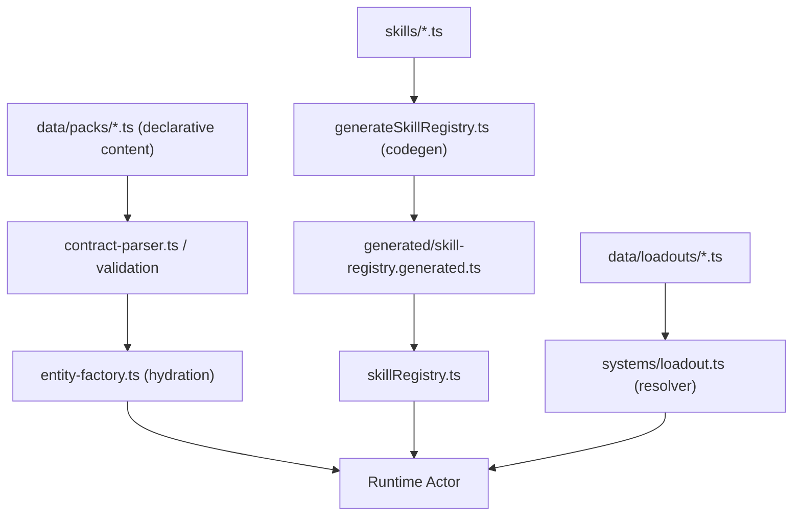

# Deep Dive: Golden Run Tests + Content Pipeline

This plan is updated to match the current codebase after the Tier 2/3/4 architecture rewrites.

## Status (February 28, 2026)

Completion snapshot:
- [x] Initiative A (Golden Runs) implemented and integrated into strict AI acceptance.
- [x] Initiative B.1 (enemy source of truth direction) landed incrementally via data-pack + entity-factory alignment.
- [x] Initiative B.2 (skill registry codegen) complete and operational.
- [x] Initiative B.3 (loadouts as data) landed (`packages/engine/src/data/loadouts/default-loadouts.ts` + resolver path).
- [x] Initiative B.4 (validation-at-boot/build direction) active via deterministic validation/test gates and script checks.

Related milestone:
- `docs/AI_CONVERGENCE_MILESTONE_2026-02-28.md`

Key updates from the original draft:
- `applyAction()` now lives in `packages/engine/src/logic.ts` (not `packages/engine/src/engine/core.ts`)
- `entity-factory.ts` moved to `packages/engine/src/systems/entities/entity-factory.ts`
- `balance-harness.ts` moved to `packages/engine/src/systems/evaluation/balance-harness.ts`
- Skill registry auto-discovery/codegen is already implemented (build-time generated registry)

## Initiative A: Golden Run Integration Tests

### Problem
Unit scenarios (`packages/engine/src/scenarios/*`) validate individual mechanics, and the harnesses validate aggregate behavior. The missing layer is a deterministic multi-turn integration test that answers:

"Given seed X and loadout Y, the run reaches floor Z with metrics in expected bounds."

This is where cross-system regressions (turn flow, tiles, AI, status timing, floor transitions) can slip through.

### What Already Exists

| Building Block | Location | Status |
|---|---|---|
| Deterministic RNG | `packages/engine/src/systems/rng.ts` | Ready |
| `applyAction()` wrapper | `packages/engine/src/logic.ts` | Ready |
| Action replay + validation | `packages/engine/src/systems/replay-validation.ts` | Ready |
| Seeded batch utilities | `packages/engine/src/systems/evaluation/harness-core.ts` | Ready |
| Initial state generation | `packages/engine/src/logic.ts` (`generateInitialState`) | Ready |
| Bot player simulation/evaluation | `packages/engine/src/systems/evaluation/balance-harness.ts` | Ready |
| Headless template test | `packages/engine/src/__tests__/headless_template.test.ts` | Skipped, identity-focused |

### Proposed Design

```text
packages/engine/src/__tests__/
  golden-runs/
    golden_run.test.ts
    fixtures/
      hoplite_3floor.json
      necromancer_5floor.json
      hunter_3floor.json
```

Each fixture defines a stable test envelope:

```ts
interface GoldenRunFixture {
  id: string;
  version: number;
  seed: string;
  loadoutId: string;      // key from DEFAULT_LOADOUTS
  floorsTarget: number;   // stop condition for "success"
  maxTurnsPerFloor: number;
  expected: {
    outcome: 'won' | 'lost' | 'timeout';
    finalFloor: [number, number];
    totalKills: [number, number];
    totalTurns: [number, number];
    playerHp: [number, number];
    fingerprint?: string; // optional strict-mode assertion
  };
}
```

### Runner Behavior

1. Start from `generateInitialState(...)` with the fixture seed/loadout.
2. Drive the run using the same bot decision path used by the balance harness (do not introduce a third AI loop).
3. Continue across floor transitions until:
   - target floor reached,
   - game over,
   - timeout cap hit.
4. Assert expected ranges.
5. If strict mode is enabled, also assert final fingerprint.

### Key Design Choices

- Default to range assertions, not exact fingerprints.
  - Ranges should catch architectural regressions.
  - Exact fingerprints are too brittle for balance/content tweaks.
- Add optional strict mode (env flag or separate test file) for exact fingerprint checks.
- On failure, emit a replay artifact (actions + summary + fingerprint) to speed triage.

### Verification Plan

- `npx vitest run packages/engine/src/__tests__/golden-runs/`
- Confirm tests pass on current engine
- Intentionally break a known rule (for example, hazard damage) and confirm at least one golden run fails

---

## Initiative B: Unified Content Pipeline

### Problem

Content definitions are still fragmented across multiple sources with overlapping responsibility:

| File | Defines | Format |
|---|---|---|
| `packages/engine/src/data/bestiary.ts` | Enemy stats/trinity/skills accessors | TypeScript objects/accessors |
| `packages/engine/src/systems/entities/entity-factory.ts` | Runtime actor hydration/defaults | Imperative code |
| `packages/engine/src/data/packs/mvp-pack.ts` | Pack-level unit/skill definitions | Declarative TS helpers |
| `packages/engine/src/skillRegistry.ts` + `packages/engine/src/generated/skill-registry.generated.ts` | Skill registry wiring | Build-time codegen (already done) |
| `packages/engine/src/systems/loadout.ts` | Player loadout definitions + resolver logic | Mixed data + code |
| `packages/engine/src/data/contracts.ts` | Schema-oriented content contracts | TypeScript interfaces |
| `packages/engine/src/data/schemas/*.json` | JSON schema validation | JSON Schema |

Core issue:
- `bestiary.ts` and `entity-factory.ts` still form a parallel content path that only partially overlaps with contracts/packs/schemas.
- As content grows (units, loadouts, tiles, biomes), drift risk increases unless "what exists" is unified behind one pipeline.

### Proposed Direction

Important: this is an incremental plan, not a big-bang rewrite. Each phase should be independently shippable.

#### Phase 1: Single Source of Truth for Enemies

- Move canonical enemy definitions into pack/contract-backed unit definitions (`BaseUnitDefinition`)
- Make `packages/engine/src/data/bestiary.ts` a thin accessor/compatibility facade over pack content
- Keep `packages/engine/src/systems/entities/entity-factory.ts` focused on hydration/runtime assembly, not content ownership
- Prefer factories that consume `BaseUnitDefinition` (directly or via compiled blueprint types)

Result:
- One place to define "what a Footman is"
- Clear pipeline: pack data -> parser/validation -> factory hydration -> runtime actor

#### Phase 2: Skill Registry Codegen (Already Complete)

Status:
- Already implemented via build-time generation
- `packages/engine/src/skillRegistry.ts` imports generated registry output from `packages/engine/src/generated/skill-registry.generated.ts`
- Generator script exists at `packages/engine/scripts/generateSkillRegistry.ts`

Do not replace this with runtime discovery.

Follow-through only:
- Ensure generator runs in CI/prebuild for changed skill files
- Document the workflow in `CONTRIBUTING.md`

Result:
- New skills do not require manual import list edits in `skillRegistry.ts`

#### Phase 3: Loadout Definitions as Data

- Split `DEFAULT_LOADOUTS` data out of `packages/engine/src/systems/loadout.ts` into declarative content files (for example `packages/engine/src/data/loadouts/*.ts`)
- Keep `loadout.ts` as resolver/normalizer/hydrator logic
- Loadouts reference `SkillID` strings and optional metadata, resolved at boot/runtime

Result:
- Loadouts become content, not hardcoded imperative definitions

#### Phase 4: Validation at Boot (or Build)

- Validate content objects against schemas/contracts during bootstrap (or as a build-time validation step)
- Fail fast with clear errors (which pack, which unit/loadout, which field)
- Reuse the existing validation patterns already present around skill metadata/profile hydration

Result:
- Content errors surface immediately instead of during gameplay

### Content Flow After Pipeline



---

## Recommended Execution Order (Updated)

`B.2` is already complete, so it is removed from the active implementation queue.

| # | Initiative | Effort | Risk | Dependencies |
|---|---|---|---|---|
| 1 | Golden Run Tests (A) | ~2-4 hours | Low | None (purely additive) |
| 2 | Enemy Source of Truth (B.1) | ~2-4 hours | Medium | None |
| 3 | Boot/Build Validation (B.4) | ~1-2 hours | Low | After B.1 |
| 4 | Loadouts as Data (B.3) | ~1-2 hours | Low-Medium | After B.1 |
| 5 | Skill Registry Codegen Follow-through (B.2) | ~15-30 min | Low | Already implemented |

Start with Initiative A first.

Reason:
- Golden runs give you a regression safety net before refactoring content definitions.
- The content pipeline work will touch enemy definitions, hydration, and loadouts across multiple systems.

---

## Implementation Notes (Recommended)

### Golden Runs: Use Existing Harness Logic

To avoid divergence:
- Reuse the balance harness action-selection path where possible
- Share helper utilities for seeded batch execution and reporting
- Keep fixture parsing and assertions in the golden-run test layer only

### Golden Runs: Keep Assertions Stable

Prefer:
- Floor reached range
- Total turns range
- HP range
- Kill range
- Optional fingerprint in strict mode

Avoid as defaults:
- Exact message logs
- Exact event sequences
- Exact action-by-action transcripts

### Content Pipeline: Keep Runtime and Content Concerns Separate

- `data/*`: declarative definitions and schemas
- parser/validation: schema + normalization
- `systems/entities/entity-factory.ts`: runtime actor creation/hydration
- `systems/loadout.ts`: runtime loadout resolution/hydration

This keeps content scaling manageable without forcing a full ECS/data-driven rewrite in one step.
